# 業務フロー

## 施設開設申請・承認フロー

施設オーナーがスポーツ施設の開設を申請し、管理者が審査・承認または却下する業務フロー。審査基準は未定義。

**参加者:** 施設オーナー (actor)、モバイルアプリ (system)、SmashHubバックエンド (system)、SQL Server (database)、管理者 (actor)、管理Webポータル (system)、通知サービス (system)

**メッセージフロー:**
- 施設オーナー → モバイルアプリ: 施設開設申請を入力・送信
- モバイルアプリ → SmashHubバックエンド: 施設開設申請登録依頼
- SmashHubバックエンド → SQL Server: 申請情報を保存
  - SQL Server ← SmashHubバックエンド: 保存結果
  - SmashHubバックエンド ← モバイルアプリ: 申請受付結果
- SmashHubバックエンド → 通知サービス: 管理者へ新規申請通知 ※要確認
- 管理者 → 管理Webポータル: 申請一覧・詳細を確認
- 管理Webポータル → SmashHubバックエンド: 申請詳細取得
- SmashHubバックエンド → SQL Server: 申請情報照会
  - SQL Server ← SmashHubバックエンド: 申請情報
  - SmashHubバックエンド ← 管理Webポータル: 申請詳細表示データ
- 管理者 → 管理Webポータル: 承認または却下を実行
- 管理Webポータル → SmashHubバックエンド: 審査結果更新依頼
- SmashHubバックエンド → SQL Server: 施設ステータス・審査結果を更新
  - SQL Server ← SmashHubバックエンド: 更新結果
- SmashHubバックエンド → 通知サービス: 施設オーナーへ審査結果通知
  - SmashHubバックエンド ← 管理Webポータル: 審査処理完了

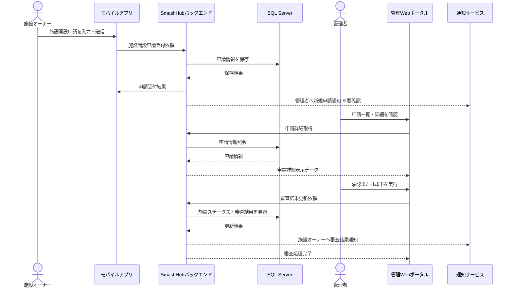

## 施設情報・営業時間・料金設定フロー

施設オーナーが施設プロフィール、画像・動画、営業時間、スポーツ別平均料金、動的料金を設定する業務フロー。

**参加者:** 施設オーナー (actor)、施設オーナー用アプリ／Web (system)、SmashHubバックエンド (system)、MinIOオブジェクトストレージ (database)、SQL Server (database)

**メッセージフロー:**
- 施設オーナー → 施設オーナー用アプリ／Web: 施設プロフィール・営業時間・料金情報を入力
- 施設オーナー用アプリ／Web → SmashHubバックエンド: 画像・動画アップロード要求
- SmashHubバックエンド → MinIOオブジェクトストレージ: メディアファイル保存
  - MinIOオブジェクトストレージ ← SmashHubバックエンド: 保存先URL返却
  - SmashHubバックエンド ← 施設オーナー用アプリ／Web: アップロード結果返却
- 施設オーナー用アプリ／Web → SmashHubバックエンド: 施設情報・営業時間・動的料金設定を保存依頼
- SmashHubバックエンド → SQL Server: 施設情報、営業時間、曜日別・時間帯別料金を保存
  - SQL Server ← SmashHubバックエンド: 保存結果
  - SmashHubバックエンド ← 施設オーナー用アプリ／Web: 設定保存完了

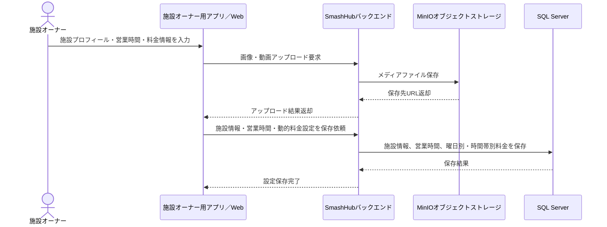

## スポーツ種目・レベル管理フロー

管理者がスポーツ種目と種目別レベルを追加・編集・削除する業務フロー。

**参加者:** 管理者 (actor)、管理Webポータル (system)、SmashHubバックエンド (system)、SQL Server (database)

**メッセージフロー:**
- 管理者 → 管理Webポータル: スポーツ種目・レベル管理画面を開く
- 管理Webポータル → SmashHubバックエンド: 種目・レベル一覧取得
- SmashHubバックエンド → SQL Server: 種目・レベル情報照会
  - SQL Server ← SmashHubバックエンド: 種目・レベル情報
  - SmashHubバックエンド ← 管理Webポータル: 一覧データ返却
- 管理者 → 管理Webポータル: 種目またはレベルを追加・編集・削除
- 管理Webポータル → SmashHubバックエンド: 種目・レベル更新依頼
- SmashHubバックエンド → SQL Server: 種目・レベル情報を更新
  - SQL Server ← SmashHubバックエンド: 更新結果
  - SmashHubバックエンド ← 管理Webポータル: 更新完了

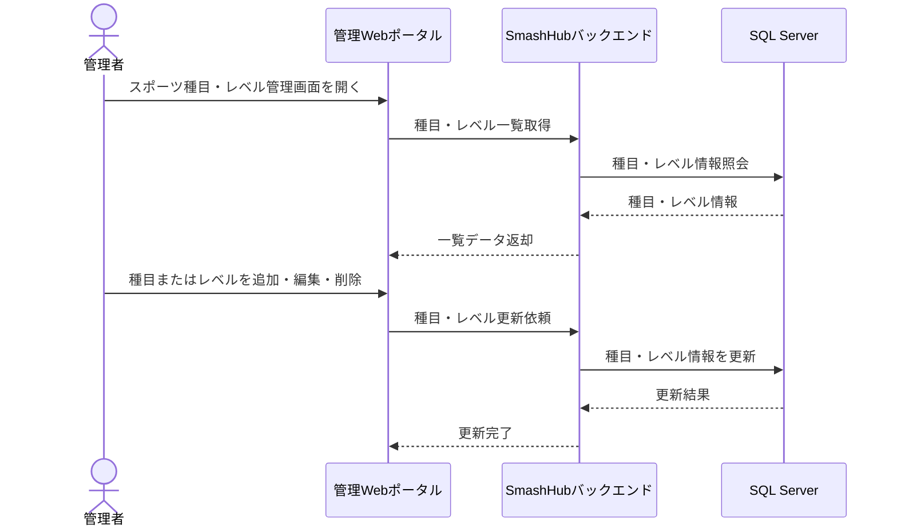

## ユーザー・アカウント管理フロー

管理者がユーザーおよび施設オーナーの情報確認、状態変更、BAN、削除を行う業務フロー。違反判定ルールは未定義。

**参加者:** 管理者 (actor)、管理Webポータル (system)、SmashHubバックエンド (system)、SQL Server (database)、通知サービス (system)、対象ユーザー／施設オーナー (actor)

**メッセージフロー:**
- 管理者 → 管理Webポータル: ユーザー一覧を検索・閲覧
- 管理Webポータル → SmashHubバックエンド: ユーザー一覧取得
- SmashHubバックエンド → SQL Server: ユーザー情報照会
  - SQL Server ← SmashHubバックエンド: ユーザー情報
  - SmashHubバックエンド ← 管理Webポータル: ユーザー一覧返却
- 管理者 → 管理Webポータル: 状態変更・BAN・削除を実行
- 管理Webポータル → SmashHubバックエンド: アカウント状態更新依頼
- SmashHubバックエンド → SQL Server: アカウント状態を更新
  - SQL Server ← SmashHubバックエンド: 更新結果
- SmashHubバックエンド → 通知サービス: 対象者へ状態変更通知 ※要確認
- 通知サービス → 対象ユーザー／施設オーナー: アカウント状態変更通知 ※要確認
  - SmashHubバックエンド ← 管理Webポータル: 処理完了

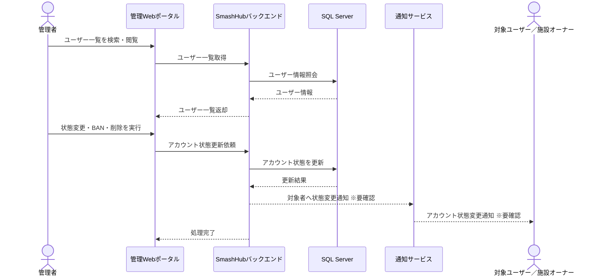

## ユーザープロフィール・競技レベル設定フロー

ユーザーがプロフィール、連絡先、CCCD、スポーツごとの競技レベルを更新する業務フロー。CCCDの確認方法は未定義。

**参加者:** ユーザー (actor)、モバイルアプリ (system)、SmashHubバックエンド (system)、MinIOオブジェクトストレージ (database)、SQL Server (database)

**メッセージフロー:**
- ユーザー → モバイルアプリ: プロフィール情報・競技レベルを入力
- モバイルアプリ → SmashHubバックエンド: アバター画像アップロード要求
- SmashHubバックエンド → MinIOオブジェクトストレージ: アバター画像保存
  - MinIOオブジェクトストレージ ← SmashHubバックエンド: 保存先URL返却
  - SmashHubバックエンド ← モバイルアプリ: アップロード結果返却
- モバイルアプリ → SmashHubバックエンド: プロフィール・CCCD・競技レベル更新依頼
- SmashHubバックエンド → SQL Server: CCCDを暗号化してプロフィール情報を保存
  - SQL Server ← SmashHubバックエンド: 保存結果
  - SmashHubバックエンド ← モバイルアプリ: 更新完了

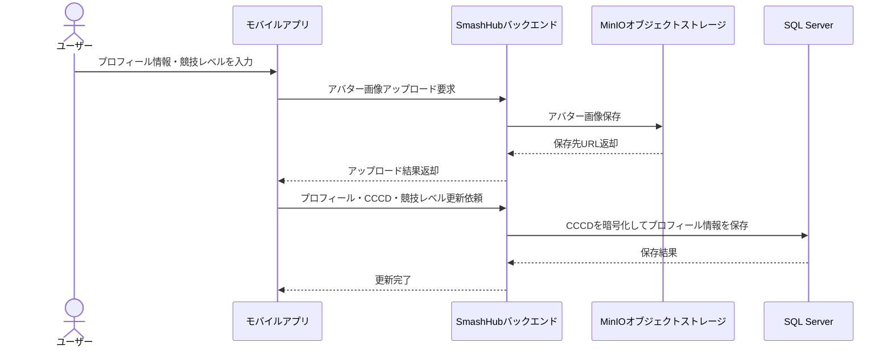

## チーム・グループ管理フロー

ユーザーがチームを作成し、リーダーがメンバー招待・削除、メンバーが参加・退出する業務フロー。退出可否判定の詳細条件は一部未定義。

**参加者:** チームリーダー (actor)、メンバー候補／メンバー (actor)、モバイルアプリ (system)、SmashHubバックエンド (system)、SQL Server (database)、通知サービス (system)

**メッセージフロー:**
- チームリーダー → モバイルアプリ: チーム作成・編集情報を入力
- モバイルアプリ → SmashHubバックエンド: チーム作成・編集依頼
- SmashHubバックエンド → SQL Server: チーム情報を保存
  - SQL Server ← SmashHubバックエンド: 保存結果
  - SmashHubバックエンド ← モバイルアプリ: チーム作成・編集完了
- チームリーダー → モバイルアプリ: メンバーを招待
- モバイルアプリ → SmashHubバックエンド: 招待依頼
- SmashHubバックエンド → SQL Server: 招待情報を保存
- SmashHubバックエンド → 通知サービス: メンバー候補へ招待通知
- 通知サービス → メンバー候補／メンバー: 招待通知
- メンバー候補／メンバー → モバイルアプリ: 招待を承諾または拒否
- モバイルアプリ → SmashHubバックエンド: 招待回答送信
- SmashHubバックエンド → SQL Server: メンバー状態を更新
  - SQL Server ← SmashHubバックエンド: 更新結果
  - SmashHubバックエンド ← モバイルアプリ: 回答処理結果
- メンバー候補／メンバー → モバイルアプリ: チーム退出を申請
- モバイルアプリ → SmashHubバックエンド: 退出可否確認・退出依頼
- SmashHubバックエンド → SQL Server: 未完了予約の有無を確認し、退出状態を更新
  - SQL Server ← SmashHubバックエンド: 退出処理結果
  - SmashHubバックエンド ← モバイルアプリ: 退出可否結果

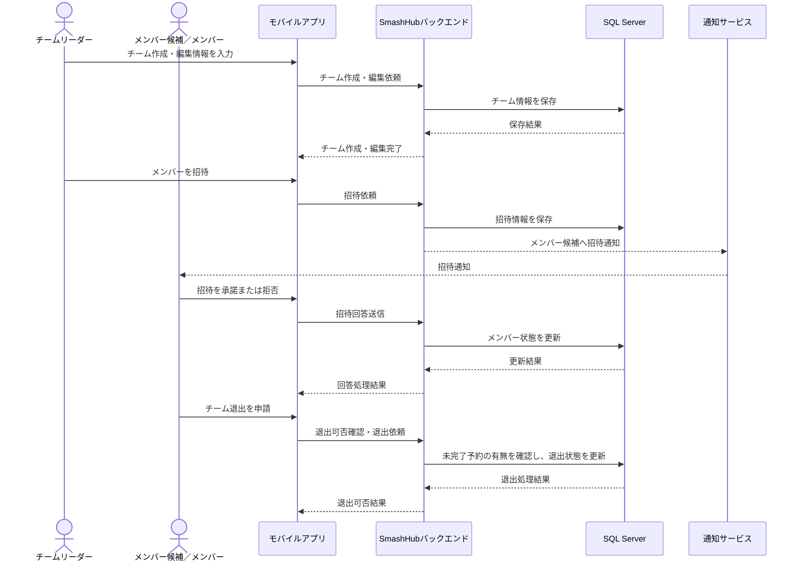

## コート予約・直接決済フロー

チームリーダーがコートを検索・予約し、決済ゲートウェイ経由で施設オーナーへ直接支払いを行う業務フロー。キャンセル規定は未定義。

**参加者:** チームリーダー (actor)、モバイルアプリ (system)、SmashHubバックエンド (system)、SQL Server (database)、決済ゲートウェイ（MoMo／MBBank／PayOS） (external)、施設オーナー (actor)、SignalRリアルタイム通知 (system)、通知／メールサービス (system)

**メッセージフロー:**
- チームリーダー → モバイルアプリ: 施設・競技・日時を指定して空き枠検索
- モバイルアプリ → SmashHubバックエンド: 空き枠検索要求
- SmashHubバックエンド → SQL Server: 施設営業時間・料金・予約状況を照会
  - SQL Server ← SmashHubバックエンド: 空き枠・料金情報
  - SmashHubバックエンド ← モバイルアプリ: 検索結果返却
- チームリーダー → モバイルアプリ: 予約枠を選択して予約申込
- モバイルアプリ → SmashHubバックエンド: 予約作成依頼
- SmashHubバックエンド → SQL Server: 同一枠の排他ロック・重複予約確認
  - SQL Server ← SmashHubバックエンド: 予約可否結果
- SmashHubバックエンド → 決済ゲートウェイ（MoMo／MBBank／PayOS）: 決済要求、施設オーナー主決済先へ送金
  - 決済ゲートウェイ（MoMo／MBBank／PayOS） ← SmashHubバックエンド: 決済結果通知
- SmashHubバックエンド → SQL Server: 予約確定・決済情報・手数料情報を保存
  - SQL Server ← SmashHubバックエンド: 保存結果
- SmashHubバックエンド → SignalRリアルタイム通知: 施設オーナーへ新規予約リアルタイム通知
- SignalRリアルタイム通知 → 施設オーナー: 新規予約通知
- SmashHubバックエンド → 通知／メールサービス: 参加メンバーへ予約完了通知・前日リマインド予約 ※要確認
  - SmashHubバックエンド ← モバイルアプリ: 予約完了結果返却

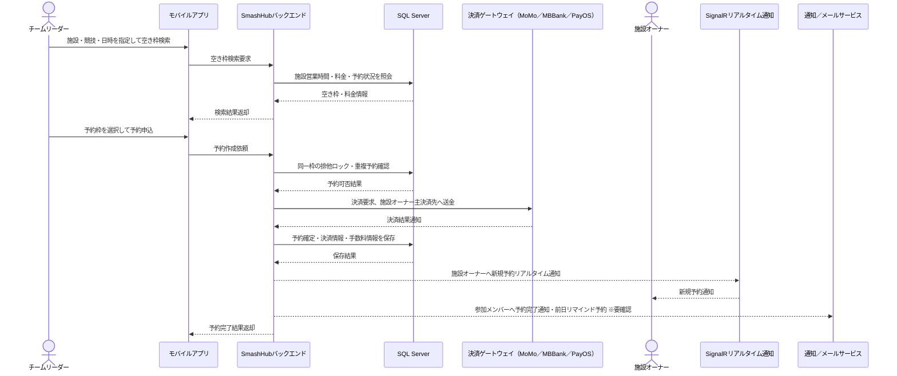

## 施設オーナー手動予約登録フロー

施設オーナーがアプリ外で受けた予約を手動登録し、アプリ予約との重複を防止する業務フロー。

**参加者:** 施設オーナー (actor)、施設オーナー用アプリ／Web (system)、SmashHubバックエンド (system)、SQL Server (database)、SignalRリアルタイム通知 (system)

**メッセージフロー:**
- 施設オーナー → 施設オーナー用アプリ／Web: 外部予約の日時・コート・顧客情報を入力
- 施設オーナー用アプリ／Web → SmashHubバックエンド: 手動予約登録依頼
- SmashHubバックエンド → SQL Server: 対象枠の重複確認・排他ロック
  - SQL Server ← SmashHubバックエンド: 登録可否結果
- SmashHubバックエンド → SQL Server: 手動予約を保存
  - SQL Server ← SmashHubバックエンド: 保存結果
- SmashHubバックエンド → SignalRリアルタイム通知: 空き枠表示をリアルタイム更新
  - SmashHubバックエンド ← 施設オーナー用アプリ／Web: 手動予約登録完了

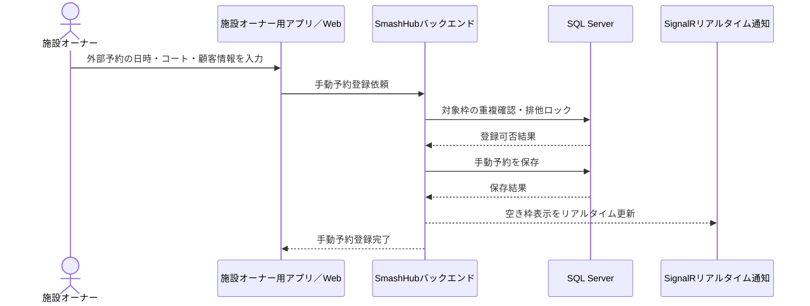

## 対戦相手募集・マッチメイキングフロー

予約済みのチームが対戦相手を募集し、別チームが参加申請、募集元リーダーが承認または拒否する業務フロー。マッチング優先順位ロジックは一部未定義。

**参加者:** チームAリーダー (actor)、チームBリーダー (actor)、モバイルアプリ (system)、SmashHubバックエンド (system)、SQL Server (database)、通知サービス (system)、決済ゲートウェイ（MoMo／MBBank／PayOS） (external)

**メッセージフロー:**
- チームAリーダー → モバイルアプリ: 予約済み枠で対戦相手募集を作成
- モバイルアプリ → SmashHubバックエンド: 募集作成依頼
- SmashHubバックエンド → SQL Server: 予約情報確認・募集情報保存
  - SQL Server ← SmashHubバックエンド: 保存結果
  - SmashHubバックエンド ← モバイルアプリ: 募集作成完了
- チームBリーダー → モバイルアプリ: 募集を検索し参加申請
- モバイルアプリ → SmashHubバックエンド: 参加申請登録依頼
- SmashHubバックエンド → SQL Server: ユーザー契約プランの申請回数制限確認 ※要確認
  - SQL Server ← SmashHubバックエンド: 申請可否結果
- SmashHubバックエンド → SQL Server: 参加申請を保存
- SmashHubバックエンド → 通知サービス: チームAリーダーへ参加申請通知
- 通知サービス → チームAリーダー: 参加申請通知
- チームAリーダー → モバイルアプリ: 参加申請を承認または拒否
- モバイルアプリ → SmashHubバックエンド: 申請回答送信
- SmashHubバックエンド → SQL Server: マッチング結果を更新
  - SQL Server ← SmashHubバックエンド: 更新結果
- SmashHubバックエンド → 決済ゲートウェイ（MoMo／MBBank／PayOS）: 承認時、2チームで予約料金を均等分割して決済調整 ※要確認
  - 決済ゲートウェイ（MoMo／MBBank／PayOS） ← SmashHubバックエンド: 決済調整結果
- SmashHubバックエンド → 通知サービス: チームBへ承認／拒否結果通知
- 通知サービス → チームBリーダー: 申請結果通知
  - SmashHubバックエンド ← モバイルアプリ: 回答処理完了

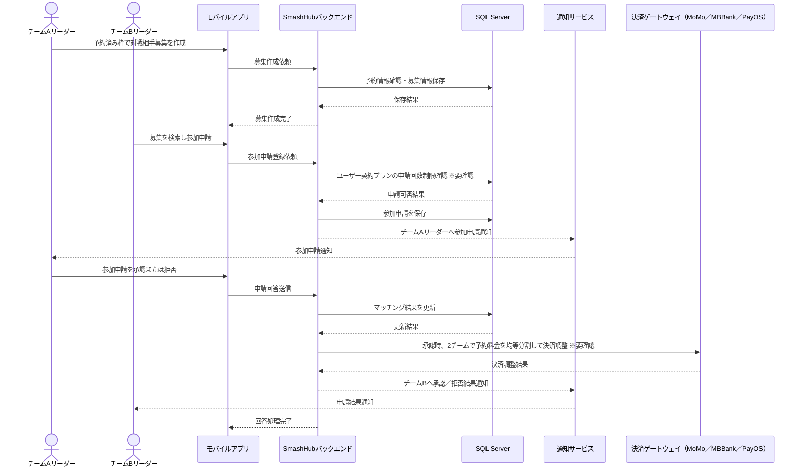

## グループチャット・通話フロー

チームメンバーがグループチャットでテキスト、画像、動画、資料を送信し、音声・ビデオ通話を開始する業務フロー。通話基盤の詳細は未定義。

**参加者:** 送信者メンバー (actor)、受信者メンバー (actor)、モバイルアプリ (system)、SmashHubバックエンド (system)、MinIOオブジェクトストレージ (database)、SQL Server (database)、SignalRリアルタイム通信 (system)、音声・ビデオ通話サービス (external)

**メッセージフロー:**
- 送信者メンバー → モバイルアプリ: メッセージまたは添付ファイルを送信
- モバイルアプリ → SmashHubバックエンド: メッセージ送信要求
- SmashHubバックエンド → MinIOオブジェクトストレージ: 添付ファイル保存
  - MinIOオブジェクトストレージ ← SmashHubバックエンド: ファイルURL返却
- SmashHubバックエンド → SQL Server: メッセージ履歴を保存
  - SQL Server ← SmashHubバックエンド: 保存結果
- SmashHubバックエンド → SignalRリアルタイム通信: グループメンバーへリアルタイム配信
- SignalRリアルタイム通信 → 受信者メンバー: メッセージ受信
  - SmashHubバックエンド ← モバイルアプリ: 送信完了
- 送信者メンバー → モバイルアプリ: 音声／ビデオ通話を開始
- モバイルアプリ → SmashHubバックエンド: 通話開始要求
- SmashHubバックエンド → 音声・ビデオ通話サービス: 通話セッション作成 ※要確認
  - 音声・ビデオ通話サービス ← SmashHubバックエンド: 通話セッション情報
- SmashHubバックエンド → SignalRリアルタイム通信: グループメンバーへ着信通知
- SignalRリアルタイム通信 → 受信者メンバー: 着信通知
  - SmashHubバックエンド ← モバイルアプリ: 通話開始情報返却

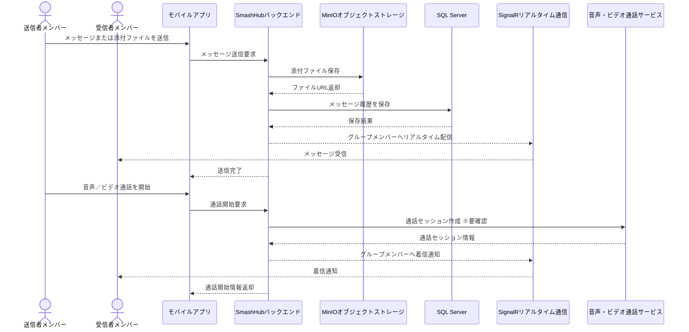

## 試合後精算・出欠集計フロー

プレー後にシステムがリーダーへ精算を依頼し、リーダーが追加費用入力、出欠確認、メンバー別割り勘金額を確定する業務フロー。徴収方法は一部未定義。

**参加者:** スケジューラー (system)、チームリーダー (actor)、チームメンバー (actor)、モバイルアプリ (system)、SmashHubバックエンド (system)、SQL Server (database)、通知サービス (system)、決済ゲートウェイ（MoMo／MBBank／PayOS） (external)

**メッセージフロー:**
- スケジューラー → SmashHubバックエンド: 予約終了時刻後に精算対象を検出
- SmashHubバックエンド → 通知サービス: リーダーへ精算・出欠入力依頼通知
- 通知サービス → チームリーダー: 精算依頼通知
- チームリーダー → モバイルアプリ: 実参加者を点呼し、追加費用を入力
- モバイルアプリ → SmashHubバックエンド: 出欠・追加費用・割り勘計算依頼
- SmashHubバックエンド → SQL Server: 予約料金、メンバー、欠席・辞退情報を照会
  - SQL Server ← SmashHubバックエンド: 計算元データ
- SmashHubバックエンド → SmashHubバックエンド: 参加者別負担額を均等計算 ※要確認
- SmashHubバックエンド → SQL Server: 出欠結果、No-show、拒否回数、精算明細を保存
  - SQL Server ← SmashHubバックエンド: 保存結果
- SmashHubバックエンド → 決済ゲートウェイ（MoMo／MBBank／PayOS）: メンバー別請求または支払依頼を作成 ※要確認
  - 決済ゲートウェイ（MoMo／MBBank／PayOS） ← SmashHubバックエンド: 請求作成結果
- SmashHubバックエンド → 通知サービス: メンバーへ精算金額通知
- 通知サービス → チームメンバー: 精算金額通知
  - SmashHubバックエンド ← モバイルアプリ: 精算確定結果返却

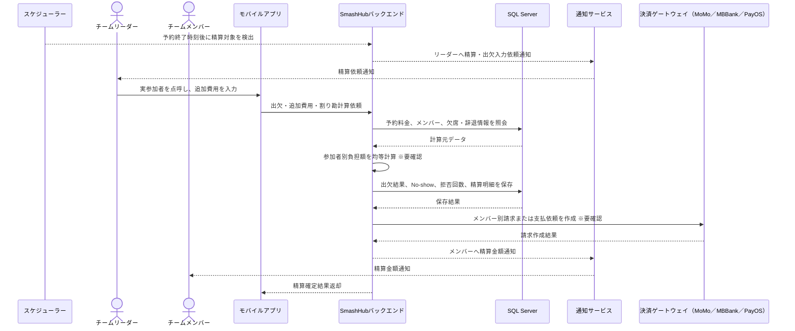

## 評価・コメント・施設投稿マーケティングフロー

ユーザーが施設を評価・コメントし、施設オーナーが投稿を作成してユーザーがコメント、シェア、いいねを行う業務フロー。投稿の審査有無は未定義。

**参加者:** ユーザー (actor)、施設オーナー (actor)、モバイルアプリ (system)、SmashHubバックエンド (system)、MinIOオブジェクトストレージ (database)、SQL Server (database)、通知サービス (system)

**メッセージフロー:**
- ユーザー → モバイルアプリ: 施設に5段階評価・コメントを投稿
- モバイルアプリ → SmashHubバックエンド: 評価・コメント登録依頼
- SmashHubバックエンド → SQL Server: 評価・コメントを保存
  - SQL Server ← SmashHubバックエンド: 保存結果
- SmashHubバックエンド → 通知サービス: 施設オーナーへ新規評価通知
- 通知サービス → 施設オーナー: 新規評価通知
  - SmashHubバックエンド ← モバイルアプリ: 投稿完了
- 施設オーナー → モバイルアプリ: 施設紹介・広告投稿を作成
- モバイルアプリ → SmashHubバックエンド: 投稿メディアアップロード要求
- SmashHubバックエンド → MinIOオブジェクトストレージ: 投稿画像・動画を保存
  - MinIOオブジェクトストレージ ← SmashHubバックエンド: 保存先URL返却
- モバイルアプリ → SmashHubバックエンド: 投稿本文・メディアURL保存依頼
- SmashHubバックエンド → SQL Server: 投稿情報を保存
  - SQL Server ← SmashHubバックエンド: 保存結果
  - SmashHubバックエンド ← モバイルアプリ: 投稿作成完了
- ユーザー → モバイルアプリ: 投稿にコメント・シェア・いいね
- モバイルアプリ → SmashHubバックエンド: エンゲージメント登録依頼
- SmashHubバックエンド → SQL Server: コメント・シェア・いいねを保存
  - SQL Server ← SmashHubバックエンド: 保存結果
  - SmashHubバックエンド ← モバイルアプリ: 操作完了

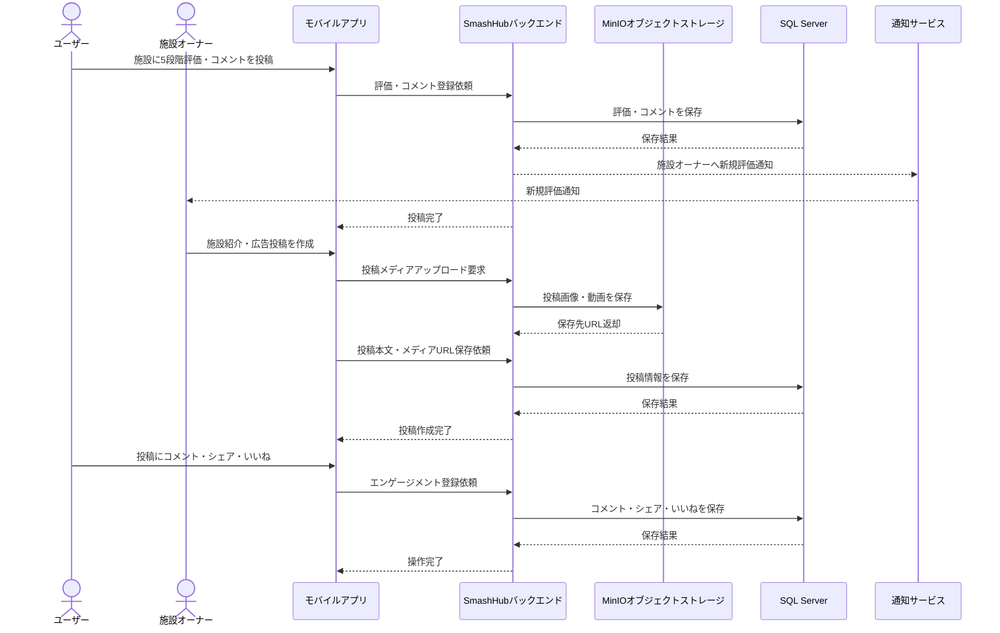

## サブスクリプション・プラン課金フロー

ユーザーまたは施設オーナーが有料プランを契約し、決済完了後に利用権限・上限が更新される業務フロー。自動更新・解約・返金条件は未定義。

**参加者:** ユーザー／施設オーナー (actor)、モバイルアプリ／Web (system)、SmashHubバックエンド (system)、SQL Server (database)、決済ゲートウェイ（MoMo／MBBank／PayOS） (external)、通知サービス (system)、管理者 (actor)

**メッセージフロー:**
- ユーザー／施設オーナー → モバイルアプリ／Web: 契約プランを選択
- モバイルアプリ／Web → SmashHubバックエンド: プラン申込依頼
- SmashHubバックエンド → SQL Server: プラン料金・現在契約状態を確認
  - SQL Server ← SmashHubバックエンド: 契約確認結果
- SmashHubバックエンド → 決済ゲートウェイ（MoMo／MBBank／PayOS）: サブスクリプション決済要求
  - 決済ゲートウェイ（MoMo／MBBank／PayOS） ← SmashHubバックエンド: 決済結果通知
- SmashHubバックエンド → SQL Server: 契約状態、利用上限、請求履歴を保存
  - SQL Server ← SmashHubバックエンド: 保存結果
- SmashHubバックエンド → 通知サービス: 契約完了通知
- 通知サービス → ユーザー／施設オーナー: 契約完了通知
- SmashHubバックエンド → 管理者: プラットフォーム売上集計に反映 ※要確認
  - SmashHubバックエンド ← モバイルアプリ／Web: 契約完了結果返却

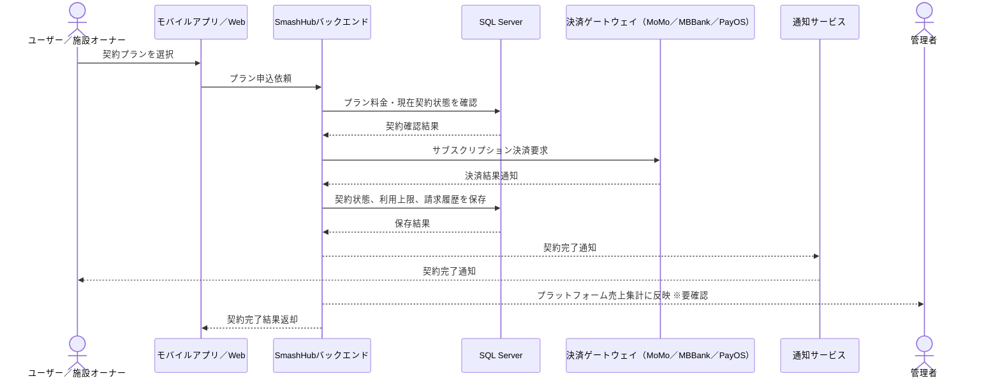

## 管理者向け決済ゲートウェイ・財務レポート管理フロー

管理者が決済ゲートウェイを管理し、ユーザー課金、施設オーナー月額費、予約手数料の収益レポートを確認する業務フロー。

**参加者:** 管理者 (actor)、管理Webポータル (system)、SmashHubバックエンド (system)、SQL Server (database)、決済ゲートウェイ（MoMo／MBBank／PayOS） (external)

**メッセージフロー:**
- 管理者 → 管理Webポータル: 決済ゲートウェイ設定を追加・編集・削除
- 管理Webポータル → SmashHubバックエンド: 決済ゲートウェイ設定更新依頼
- SmashHubバックエンド → 決済ゲートウェイ（MoMo／MBBank／PayOS）: 接続情報・認証情報の疎通確認 ※要確認
  - 決済ゲートウェイ（MoMo／MBBank／PayOS） ← SmashHubバックエンド: 疎通確認結果
- SmashHubバックエンド → SQL Server: 決済ゲートウェイ設定を保存
  - SQL Server ← SmashHubバックエンド: 保存結果
  - SmashHubバックエンド ← 管理Webポータル: 設定更新完了
- 管理者 → 管理Webポータル: 財務・収益レポートを閲覧
- 管理Webポータル → SmashHubバックエンド: 収益レポート取得依頼
- SmashHubバックエンド → SQL Server: ユーザー課金、施設月額費、予約手数料を集計
  - SQL Server ← SmashHubバックエンド: 集計結果
  - SmashHubバックエンド ← 管理Webポータル: 財務レポート表示データ返却

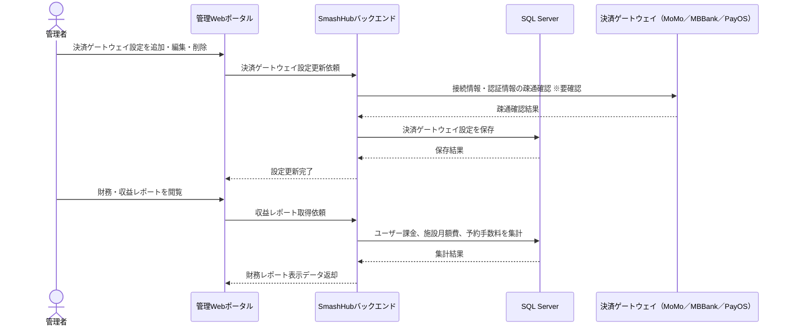
