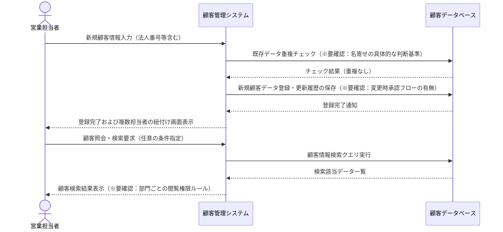
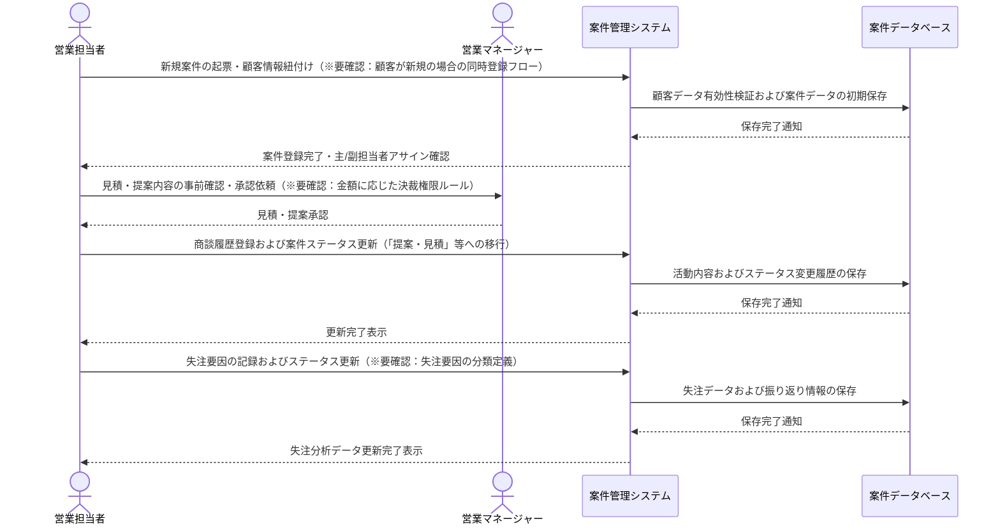
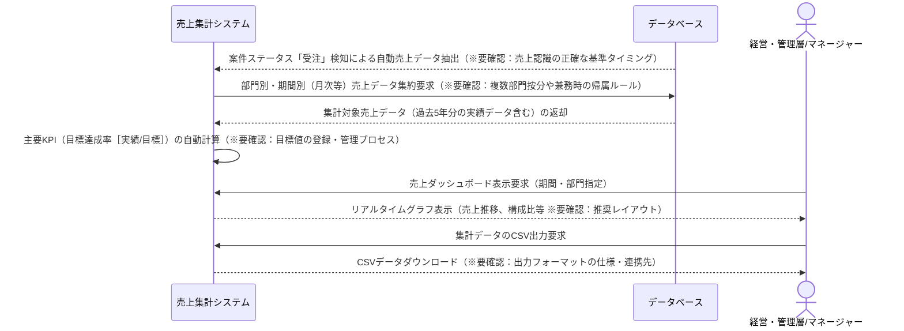

# 業務フロー

## 顧客管理

新規取引先の登録から、重複チェック、履歴管理、担当者紐付け、および検索照会を行う一連の業務フロー

**参加者:** 営業担当者 (actor)、顧客管理システム (system)、顧客データベース (database)

**メッセージフロー:**
- 営業担当者 → 顧客管理システム: 新規顧客情報入力（法人番号等含む）
- 顧客管理システム → 顧客データベース: 既存データ重複チェック（※要確認：名寄せの具体的な判断基準）
  - 顧客データベース ← 顧客管理システム: チェック結果（重複なし）
- 顧客管理システム → 顧客データベース: 新規顧客データ登録・更新履歴の保存（※要確認：変更時承認フローの有無）
  - 顧客データベース ← 顧客管理システム: 登録完了通知
  - 顧客管理システム ← 営業担当者: 登録完了および複数担当者の紐付け画面表示
- 営業担当者 → 顧客管理システム: 顧客照会・検索要求（任意の条件指定）
- 顧客管理システム → 顧客データベース: 顧客情報検索クエリ実行
  - 顧客データベース ← 顧客管理システム: 検索該当データ一覧
  - 顧客管理システム ← 営業担当者: 顧客検索結果表示（※要確認：部門ごとの閲覧権限ルール）

## 案件・進捗管理

新規案件の起票、進捗更新、見積・提案時の承認、活動記録の登録、失注分析にいたる営業プロセスの業務フロー

**参加者:** 営業担当者 (actor)、営業マネージャー (actor)、案件管理システム (system)、案件データベース (database)

**メッセージフロー:**
- 営業担当者 → 案件管理システム: 新規案件の起票・顧客情報紐付け（※要確認：顧客が新規の場合の同時登録フロー）
- 案件管理システム → 案件データベース: 顧客データ有効性検証および案件データの初期保存
  - 案件データベース ← 案件管理システム: 保存完了通知
  - 案件管理システム ← 営業担当者: 案件登録完了・主/副担当者アサイン確認
- 営業担当者 → 営業マネージャー: 見積・提案内容の事前確認・承認依頼（※要確認：金額に応じた決裁権限ルール）
  - 営業マネージャー ← 営業担当者: 見積・提案承認
- 営業担当者 → 案件管理システム: 商談履歴登録および案件ステータス更新（「提案・見積」等への移行）
- 案件管理システム → 案件データベース: 活動内容およびステータス変更履歴の保存
  - 案件データベース ← 案件管理システム: 保存完了通知
  - 案件管理システム ← 営業担当者: 更新完了表示
- 営業担当者 → 案件管理システム: 失注要因の記録およびステータス更新（※要確認：失注要因の分類定義）
- 案件管理システム → 案件データベース: 失注データおよび振り返り情報の保存
  - 案件データベース ← 案件管理システム: 保存完了通知
  - 案件管理システム ← 営業担当者: 失注分析データ更新完了表示

## 売上集計・ダッシュボード

完了案件からの売上自動集計、KPI（目標達成率）算出、ダッシュボードでの可視化、およびCSV出力に関する業務フロー

**参加者:** 売上集計システム (system)、データベース (database)、経営・管理層/マネージャー (actor)

**メッセージフロー:**
- データベース → 売上集計システム: 案件ステータス「受注」検知による自動売上データ抽出（※要確認：売上認識の正確な基準タイミング）
- 売上集計システム → データベース: 部門別・期間別（月次等）売上データ集約要求（※要確認：複数部門按分や兼務時の帰属ルール）
  - データベース ← 売上集計システム: 集計対象売上データ（過去5年分の実績データ含む）の返却
- 売上集計システム → 売上集計システム: 主要KPI（目標達成率［実績/目標］）の自動計算（※要確認：目標値の登録・管理プロセス）
- 経営・管理層/マネージャー → 売上集計システム: 売上ダッシュボード表示要求（期間・部門指定）
  - 売上集計システム ← 経営・管理層/マネージャー: リアルタイムグラフ表示（売上推移、構成比等 ※要確認：推奨レイアウト）
- 経営・管理層/マネージャー → 売上集計システム: 集計データのCSV出力要求
  - 売上集計システム ← 経営・管理層/マネージャー: CSVデータダウンロード（※要確認：出力フォーマットの仕様・連携先）

