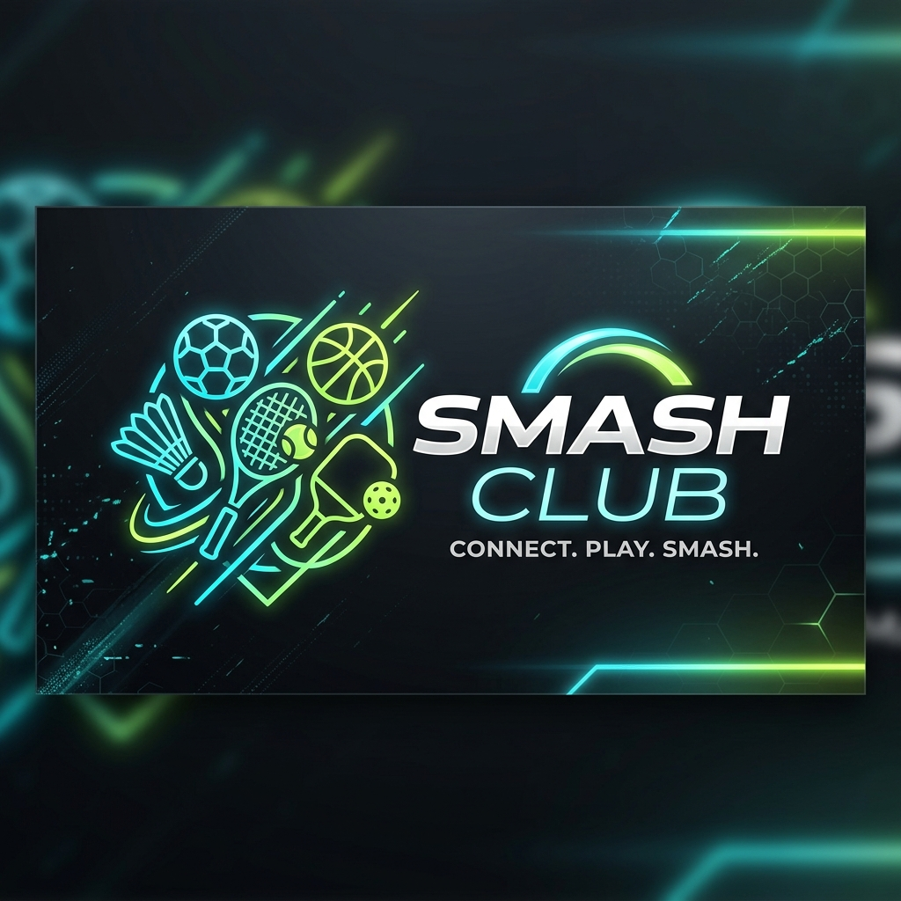

<p align="center">
  
</p>

# ⚡ SmashHub — The Ultimate Sports Connection Platform

<p align="center">
  <a href="https://react.dev/"></a>
  <a href="https://vite.dev/"></a>
  <a href="https://tailwindcss.com/"></a>
  <a href="https://flutter.dev/"></a>
  <a href="https://learn.microsoft.com/en-us/sql/sql-server/"></a>
  <a href="https://dotnet.microsoft.com/"></a>
</p>

---

## 🌟 The Vision Pivot

**SmashHub** has evolved! What started as a dedicated badminton booking application has expanded into a comprehensive, high-octane **Sports Connection Platform**. 

Our new mission is to **connect people through active play** and build a social networking environment tailored for modern sports enthusiasts. By moving beyond single-sport limitations, SmashHub bridges the gap between active athletes, coaches, and facility managers across a diverse suite of athletic disciplines:

*   🏸 **Badminton** — High-speed rallies, community court shares, and ladder tournaments.
*   ⚽ **Soccer** — 5-a-side and 11-a-side matches, pickup game coordinators, and field reservations.
*   🏀 **Basketball** — Half-court 3v3s, full-court runs, and localized street leagues.
*   Volleyball — Beach and indoor court matchups, tournament schedulers, and team signups.
*   🎾 **Tennis** — Singles or doubles matching, rank-based matchups, and court bookings.
*   🏓 **Pickleball** — The fastest-growing court sport, introducing casual playgroups, equipment shares, and social nights.

We are shifting the community mindset towards an **active, accessible, and highly social sports networking ecosystem**. Whether you want to find an extra player for a weekend run, challenge localized teams, or split the booking cost of your local court, SmashHub is your perfect match.

---

## 🏗️ Monorepo Architecture

SmashHub is structured as a scalable, developer-friendly monorepo designed to facilitate independent front-end, mobile, and back-end database operations. 

```
SmashHub/
├── Website/                  # React 19 + Vite 8 + Tailwind v4 Web Frontend
├── AndroidApp/               # Planned Flutter Mobile Client
├── SportBooking_Database/    # SQL Server Schemas & Backend Foundation
│   └── SportBooking_Database.sql
├── smashhub_banner.png      # Core branding asset
└── README.md                 # Project root documentation
```

### Component Breakdown

*   ### [Website](file:///d:/Github/SmashHub/Website)
    The client-facing web application. Engineered with **ReactJS 19 (Vite 8)** and **Tailwind CSS v4** featuring a modular *Feature-First Architecture*. It integrates a smooth **Light/Dark mode switcher** with custom transitions, beautiful Montserrat typography, responsive layouts, and modern **glassmorphism** visual aesthetics.
*   ### [AndroidApp](file:///d:/Github/SmashHub/AndroidApp)
    The planned cross-platform mobile application. Leveraging **Flutter** to provide natively compiled, high-performance user experiences for iOS and Android, allowing players to coordinate sessions on the go.
*   ### [SportBooking_Database](file:///d:/Github/SmashHub/SportBooking_Database.sql)
    The robust structural database schema powered by **SQL Server 2022**. It features a comprehensive, multi-sport schema including:
    *   **User & Session Security**: Multi-role structures (User, Admin) and high-security Refresh Token integrations.
    *   **Multi-Sport Level Profiles**: User sports profiles that evaluate player levels (Beginner, Intermediate, Advanced) independently for each sport.
    *   **Social & Team Coordination**: Multi-sport club/team registries, member tracking, and dynamic secure invite links.
    *   **Booking & Attendance Schedules**: Scheduling pipelines with cost-splitting parameters, location data, and active attendee validation.

---

## 🛠️ The Tech Stack

### Currently Active
*   **Web Frontend:** ⚛️ [React 19](https://react.dev/), [Vite 8](https://vite.dev/), [React Router v7](https://reactrouter.com/)
*   **Styling & FX:** 🎨 [Tailwind CSS v4](https://tailwindcss.com/), [Lucide React](https://lucide.dev/), Custom Glassmorphic CSS Engine
*   **Typography:** ✒️ Google Montserrat Font Family
*   **Relational Database:** 🗄️ [Microsoft SQL Server 2022](https://www.microsoft.com/sql-server)

### Planned Roadmap Stack
*   **Mobile Client:** 📱 [Flutter](https://flutter.dev/) (Dart)
*   **Backend RESTful API:** ⚙️ [C# ASP.NET Core Web API](https://dotnet.microsoft.com/apps/aspnet/apis)
*   **ORM Layer:** 🔄 [Entity Framework Core](https://learn.microsoft.com/en-us/ef/core/)
*   **Caching & Queueing:** ⚡ [Redis](https://redis.io/)

---

## 🚀 Getting Started (Website Local Development)

To run the web front-end interface on your machine, follow these instructions:

### Prerequisites
Make sure you have [Node.js](https://nodejs.org/) installed (version `18.x` or higher is highly recommended).

### Installation & Launch Steps

1.  **Clone the project repository** (if you haven't already):
    ```bash
    git clone https://github.com/Huy19N/SmashHub.git
    cd SmashHub
    ```

2.  **Navigate into the Website folder**:
    ```bash
    cd Website
    ```

3.  **Install the dependencies**:
    ```bash
    npm install
    ```

4.  **Run the local development server**:
    ```bash
    npm run dev
    ```

Once started, Vite will output the local development URL (typically `http://localhost:5173`). Open it in your browser to experience the SmashHub portal.

### Highlights of the Current Frontend
*   **Adaptive Styling:** Switch between Light & Dark modes to see form designs morph automatically with beautiful image crossfades.
*   **Premium Glassmorphism:** Input forms feature responsive glowing cyan/green outline animations and visual overlays.
*   **Clean Component Library:** Customized buttons, input wrappers, and circular checkboxes designed for accessibility.
*   **SEO Prepped:** Out-of-the-box SEO optimization utilizing react-router layouts.

---

## 📈 Roadmap & Core Milestones

*   [x] Establish multi-sport responsive Web Mockups (React & Tailwind CSS v4).
*   [x] Expand relational SQL Server Database Schema to handle complex team roles, multiple sport profiles, and schedules.
*   [ ] Initialize the **Flutter Mobile App** repository for `/AndroidApp`.
*   [ ] Build out the **C# ASP.NET Web API** backend logic to connect Web/Mobile clients directly with SQL Server.
*   [ ] Implement real-time coordinate matching based on localized sport levels.

---

<p align="center">
  <sub>Developed with ❤️ by the SmashHub Engineering Team. Shifting communities towards active sports connection.</sub>
</p>
